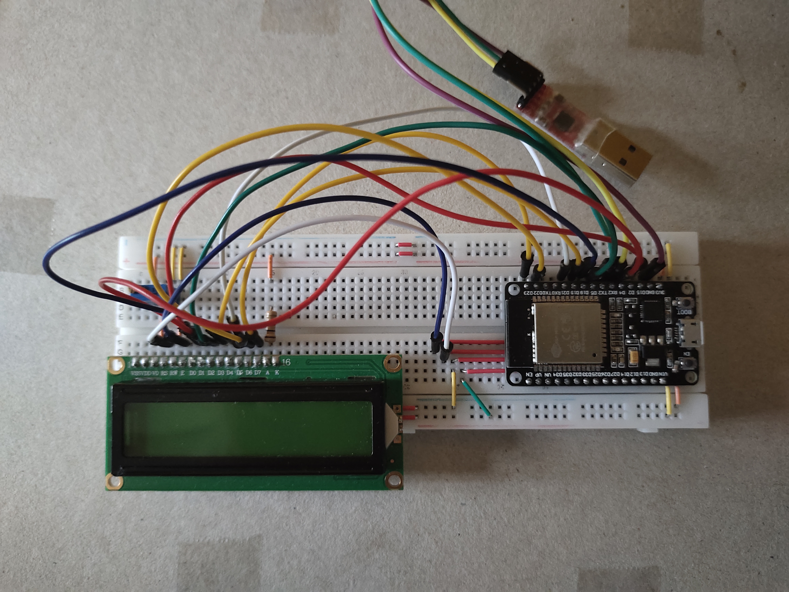

# Hello world!
This project is for people who are new to ESP32 and IDF tools, but familiar with C and C++ languages. Here I will discribe how to write a code, build it and program your device with Espressif's tools. You will see that it is very easy to do. This is my first project that demonstrates how ESP32 can interact with display HD44780 and UART.

## BOM
- [10 kOm potentiometer](https://www.ebay.de/itm/334246193314?hash=item4dd2a028a2:g:kMcAAOSwEAthr6dJ&amdata=enc%3AAQAHAAAAoJV6yad94cJgTjC8%2FY8x864QYT47w5xPvzHCMmnFOtz2QjE5g4QUxJ8cc1YoNNNxO2qTzI4OQtH3L1CGB1loFwexTTaCv8CZZOlnaQ0P%2F%2B4WivCr39g7fwqTQoCK5g0tezRGuVzgu91Fnz5%2B8db%2FQywsyNXZHGA9sT1mPGZmQvA46THOWDKpQz0OQiwhRPWYrZdNYulPoicG554TQUbX%2FO8%3D%7Ctkp%3ABk9SR-zq6p7zYA)
- [100 Om resistor](https://www.ebay.de/itm/372813822157?hash=item56cd6f78cd:g:-vAAAOSwqApdrrTg&amdata=enc%3AAQAHAAAA4BIrK%2FDHVffTpnB7eg%2Fl%2BJpxDdNC8ih4zmqnf05%2BK1uUI6sfbARtzaJVbB5XePqFTyD2c%2FLbxGS8n97ZHvlqpZgWSRux6K6UVj2S38ilgdBKUlFsPXNdlYil8E1KvV6AdUaEaPKW8zLsJ6D9Gf4P6S3j%2BbJM22SVSyboQzB6iO7%2B%2FBAhI%2FY39mwd2yylliq16a%2BNlWUx4crXvsRAxRXtd1VvSUFDtaXWdptp7N%2FI%2BDtAnONTSCujgD%2BjMv%2FGd4zNKzwTpC0qEPtlUsyaXTiHg705dsiNEWfawRWnqOlmIyLx%7Ctkp%3ABFBMnLH5nvNg)
- [Breadboard](https://www.ebay.de/itm/143411990842?hash=item216405513a:g:21oAAOSwcaJh-4iE&amdata=enc%3AAQAHAAAA4DOfUPY7MQvgpxBmUjmlj73z2qkFg6GQhSxvOW2CUbk3QgLAo7FV8qW3idjHV5M7vzZPuH%2FmQicMmEFty3z8FZMqOS4XQv7Zg0kjCOEU3UEOdw1G8vP7urPyYLlDpJ2pc8cDgrYmdvZZ5eeDVb%2BYIsWCm5F%2BedXm4OW53pZMq4mRPwTHTm0c%2B5AcTzJ4j4mOXtxwOsNz4udGfdxQgZrdMQpKi3NTFE9jVhj98wb322NkyFsx%2Bdi%2Bi%2BubLHwJjSeLl8n5cyr2aLoGtxLE5eXW4JCYw%2F4JAjmlpJa%2BIcmZFmTq%7Ctkp%3ABFBM8KLnnPNg)
- [USB UART Converter CP2102](https://www.ebay.com/itm/401092508083?hash=item5d62f9f9b3:g:2aQAAOSw0kNXhzR7&amdata=enc%3AAQAHAAAA4FRi2Y7Vfd8Q%2Bd3HN5SaITS3tNN0zc3q358pDhUu6ydlAzBIbA9Vigt253eM745DU8AOWKonZXbCt%2BnMj9VaJmHKJjMLOdhVag7GCGPBTUhBaFeaajgtQOcjXufFkW9YGrDp3CxhILDmf01N3%2F7EPNkE%2Bn%2BMPnAs8JYJZeRZpqzIyWdHInrZOfTqdPH2BQRIjIW%2Bwg7hbHjCqudx1rtQWWVtEUHH2micEoSUatc1x8CvgVUymCxMUZTlJnV1GkCrJVK%2FCOJsQ98oxYIZX%2FFpIRA8bjgwRofGwNBReZaBUm3b%7Ctkp%3ABk9SR-z_mozzYA)
- [16x2 HD44780 Character LCD Display](https://www.ebay.com/itm/171907642472?hash=item28067e7468:g:o0EAAOSw0e9UsH49&amdata=enc%3AAQAHAAAAoNlaN%2Br17jDkupyfVu2mrEMyktoO9i1ITZQtAYmK3JM6jPL4WQtdDTsZz9KnBpwTXfQUpsABM8zbWSjGZHv1JYrMTZdymTOvxvKW%2FVK7qM6HcqrACgH9ZCKV2yRcZUHW0Sb1g9H7xFwMLM85L0O%2F7G6d7FXR4FMYxA9PFgBEsTtE3j4Y2vvE4vpA5bb1NbxE5AC3C4ZxNy4GmHL0t9n1FCA%3D%7Ctkp%3ABk9SR7zviozzYA)
- [ESP32 ESP-32S WLAN Dev Kit Board](https://www.ebay.com/itm/165187291745?hash=item2675ee0a61:g:wFMAAOSwUU9hlJU7&amdata=enc%3AAQAHAAAA4GkCPPvkkg2BdnKZpnivLZEqtm15CmOftHWvmkGXRnOFQmZpzLU6z3bswX6jKmKC%2FFU6IYI%2FghJZ10KnXfVAhMh8lLDEst9nFzZkBe8ptQPgr6CxqXDZSd2Jwkk3xHqpFpgU%2FUO9evHH6Y652v2X%2FvDzauY3hX7ArFFo5ZtKpwe53CfAgx%2FpRc1bMZoliimqjU55z0FoP5rCBbBFGiY5im%2FcJkT6Ax4b%2BC5lEcJUwnmEjXu3zRXEzHV27C7gFfX%2FF6FDrw3WedjM79yXGFDnX4URKpAFbDgPeXJC%2Bb6IjPnf%7Ctkp%3ABFBMoomHkfNg)

Nowadays exists so many different development boards. Here I chose the most popular one ESP32 Devkit. Display HD44780 is cheap and very simple device. Also you can easily find documentation and examples on the internet. There are two types of it (with and without I2C interface). I decided to order the display without I2C interface which worked in four bit mode. To be able to send and receive messages from computer I had USB UART converter.

## Scheme
This scheme is assebled on the breadboard. It allows you to try both display modes (eight and four bit). Instead of using power supply we get power from ESP32 board. A 10kOm resistor is used to adjust the display contrast and 100 Om resistor to limit current of backlight.

  

## Code
I started writing a program in pure C, but later switched to C++ due to the fact that using classes you can write more optimal code. So this programm consists of two clases(display and uart) and one UartRx task which is responsible for comunication with a computer. So let's start from the display class. It has three constructors to initialize it (one for four bit mode, one for eight bit mode and one default) and auxiliary mothods to control the LCD. In this example I implemented a lot of different functions. The most interesting of them is CGRAMSymbol that allows you to create your own symbol and save it into display's memory. For this LCD you can store only eight symbols. Class Uart has only one function and a constructor. This method allows us to print string into a terminal.

## How to make the project work
If you make any changes to the project you must be sure that #define for corresponding pins are correct and you chose right constructor to initialize LCD and Uart. Also you have to check in **idf.py menuconfig**, if freertos runs it 1000 Hz frequency. To build and flash the board you should use idf.py script.